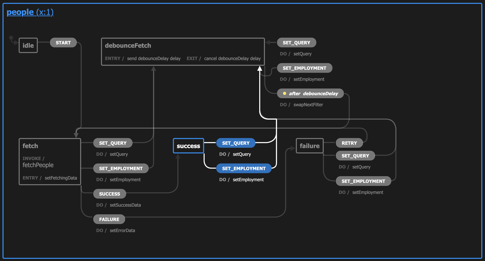

# People list Finite State Machine



## Design decisions

First of all, why **XState**: even if I'm not an XState expert yet, I chose it because I think it's a superior tool to manage, read, and document Finite State Machines, compared to reading "long" `useReducer` code or jumping through React hooks trying to understand what every `useEffect` does. I think that's  [David Khourshid's "Redux is half of a pattern"](https://dev.to/davidkpiano/redux-is-half-of-a-pattern-1-2-1hd7) is good reading for this topic. I got inspired by this article and by my willingness to gain experience with XState, to understand if I/we like the development pattern XState introduces carefully. Please note that we recently started using it at work, and I'm currently driving an XState Working Group.

### Machine

The design patterns used in the code of the Finite State Machine are:

- **the machine' initial state is `idle`**: initially, the People must be fetched to fill the list, and it will happen when the People page mount. Anyway, moving the machine from its initial "idle" state to fetching the People is a controlled event that must be sent by the People page itself, avoiding the machine to deliberately start fetching in a moment the app doesn't expect it to do.

```ts
export const machine = createMachine<Context, Events, States>(
  {
    initial: 'idle',
    // ...
  }
```

- **the events are uppercased**: more, events are the only entity with an upper-cased name, to distinguish them from the rest of the entities.

- **preferring readability over smartness for transitions**: the `SET_QUERY`/`SET_EMPLOYMENT` transitions are repeated for many states (less than five times, though). This is my choice, preferring the reader to immediately understand the managed events for each state, instead of jumping around the code because of an unnecessary abstraction.

- **avoiding inline callbacks and services**: callbacks and services can be invoked inline or moved to the machine's configuration object (the second `createMachine` parameter). This is primarily important for testing purposes, allowing the tests to override the configuration through the `machine.withConfig` function, instead of mocking the imported services (`fetchPeople`, in this case).

```ts
export const machine = createMachine<Context, Events, States>(
  {
    /* ... */
  },
  {
    services: {
      // <-- NOTE: Services goe here
      // ...
    },
  },
)
```

- **avoiding inline delays**: the previous point is valid for the debounce delay too, if in the future the machine's delay changes, nothing changes for the tests, which override the debounce delay.

```ts
export const machine = createMachine<Context, Events, States>(
  {
    /* ... */
  },
  {
    delays: {
      // <-- NOTE: Delays goe here
      // ...
    },
  },
)
```

### Types

The design patterns used for the Finite State Machine' types are:

- **every context includes only its specific overrides**: the machine' context always has all the properties, but the various `InitialContext`, `DebounceFetchContext`, etc. types specify only their specific content. They're not meant to be used isolated, but always through a `Context & InitialContext`-like intersection.

```ts
export type InitialContext = {
  filter: Filter
  debounceFilter: undefined
  fetching: false
  people: []
  fetchErrors: []
}

export type DebounceFetchContext = {
  debounceFilter: Filter // <-- NOTE: Specify only the properties to override
}

export type States =
  | { value: 'idle'; context: Context & InitialContext }
  | { value: 'success'; context: Context & SuccessContext }
  | { value: 'fetch'; context: Context & FetchContext }
  | { value: 'debounceFetch'; context: Context & DebounceFetchContext } // <-- NOTE: the `Context & DebounceFetchContext` type
  | { value: 'failure'; context: Context & FailureContext }
```

- **event categories**: in the `types` module, the events are categorized based on
  - the internal events, especially the ones that bring data
  - the external events triggered directly by the user
  - the external events not triggered directly by the user (ex. the `START` event that moves the machine away from its idle state)

This allows the reader to immediately get an idea of what are the events thought for

```ts
// ---------------------------------------------------------------
// EVENTS
export type Events = InternalEvents | ExternalEvents | UserEvents
```

### Tests

The design patterns used for the tests of the Finite State Machine are:

- **strong readability**: I care a lot about tests' readability because they're the tools used to understand how the code works, and they must have a complexity level 10x lower than the code under test. The topic is quite subjective, obviously, but I tried my best to ease the future developers that
  - want to understand what the machine does to refactor it
  - need to fix the tests that are unexpectedly failing

The latter case is the most problematic. Usually, I tried to get the tests as clear as possible to ease the work of the fixing-tests developer that needs an immediate idea of how the tests work to fix them as fast as possible.

- **local mock data**: this point is strictly related to the "readability" one. I think that if the mock data are simple, they must stay in the same file to avoid external dependencies (take a look at `defaultFetchData` in `machine.test.ts`).

- **linear testing flow and internal events**: the [Testing services chapter of the Testing Machines docs](https://xstate.js.org/docs/guides/testing.html#testing-services) pushes the developer to test a service-based machine like the following

```ts
it('should eventually reach "success"', done => {
  const service = interpret(machine).onTransition(state => {
    if (state.matches('success')) {
      done() // <-- NOTE: asserting/succeeding first
    }
  })

  service.start()
  service.send({
    type: 'SUCESSS',
    people: [
      /*...*/
    ],
  }) // <-- NOTE: acting last
})
```

but:

- this worsen the readability because commonly, the tests have the assertion/success as the last step
- at the same time, the `{ type: 'SUCESSS', people: [/*...*/] })` is an internal event that no one must know, not even the machine' tests, because it's an implementation detail

To satisfy the above points, I prefer a test that looks like

```ts
// ARRANGE
const { service, resolveFetchMock } = createMockedMachine()

// ACT
// NOTE: it's an external event, it's fine expliciting it
service.send({ type: 'START' })
// NOTE: exxternal services are managed through dedicated utilities, allow concentrating on the `data`
// the service should return
resolveFetchMock(defaultFetchData)

// ASSERT
expect(service.state).toMatchObject({
  value: 'success',
  context: { people: defaultFetchData, fetching: false },
})
```

- **`createMockedMachine utility`**: I first written all the tests, then carefully analyzed which code was common for all the tests that worsened their readability. The `createMockedMachine` utility creates a minimal configured machine but returns some utilities that allow controlling the fake `fetchPeople` service.

- **clear testing blocks**: every test, short or long, have clear `ARRANGE/ACT/ASSERT` blocks

- **test approach**: to test this machine, there are three main kinds of approaches

  1. a **functional test**-like approach: a user flow is performed, there isn't a clear "end" of the test, multiple-input combinations are tried in the same test
  2. a **single-flow** approach: every test contains multiple steps but is oriented to a single, clear, final result
  3. a **single-transition** approach: the machine starts in a specific state, an event is sent, the next state is checked out

  I opted for the second approach because:

  - the first approach leads too much to create a clone of the functional, browser-based, tests
  - the first approach generates very long tests, hard to follow without a "visual" counterpart
  - the third approach is too much oriented to test the machine' implementation details
  - the third approach needs the developer to know the XState' internal events

Test examples

<details>
  <summary>First approach example</summary>

```ts
it('When the fetch fails, should allow retrying with the same filter and clear the errors', async () => {
  // ARRANGE
  const debounceDelay = 1
  const query = 'Ann Henry'
  const filteredFetchData = [annHenry]
  const {
    service,
    fetchMock,
    rejectFetchMock,
    resolveFetchMock,
    waitDebouncedFetch,
  } = createMockedMachine(debounceDelay)

  // 1. START THE MACHINE
  service.send({ type: 'START' })
  expect(fetchMock).toHaveBeenCalledTimes(1)

  // 2. REJECT THE FETCH
  rejectFetchMock(error)
  expect(service.state).toMatchObject({
    value: 'failure',
    context: { fetchErrors: [error] },
  })

  // 3. CHANGE THE QUERY
  service.send({ type: 'SET_QUERY', query })

  // 4. DEBOUNCED FETCH
  await waitDebouncedFetch()

  // 5. REJECT THE FETCH
  rejectFetchMock(error)
  expect(service.state).toMatchObject({ context: { fetchErrors: [error, error] } })
  expect(fetchMock).toHaveBeenCalledTimes(2)

  // 6. RETRY FETCHING
  service.send({ type: 'RETRY' })

  // 7. RESOLVE THE FETCH
  resolveFetchMock(filteredFetchData)
  expect(service.state).toMatchObject({
    value: 'success',
    context: { fetchErrors: [], people: filteredFetchData },
  })
  expect(fetchMock).toHaveBeenCalledTimes(3)

  // 8. CHECK THE THIRD FETCH' QUERY
  expect(fetchMock).toHaveBeenLastCalledWith(
    // machine' context
    expect.objectContaining({ filter: expect.objectContaining({ query }) }),
    // machine' states and invokeMeta, useless for the purpose of the tests
    expect.anything(),
    expect.anything(),
  )
})
```

</details>
<details>
  <summary>Second approach example</summary>

```ts
it('When retrying, should retry with the last query', async () => {
  // ARRANGE
  const query = 'Ann Henry'
  const {
    service,
    fetchMock,
    rejectFetchMock,
    resolveFetchMock,
    waitDebouncedFetch,
  } = createMockedMachine(1)

  // ACT
  service.send({ type: 'START' })
  resolveFetchMock(defaultFetchData)
  service.send({ type: 'SET_QUERY', query })
  await waitDebouncedFetch()
  rejectFetchMock(error)
  service.send({ type: 'RETRY' })
  await waitDebouncedFetch()

  // ASSERT
  expect(fetchMock).toHaveBeenLastCalledWith(
    // machine' context
    expect.objectContaining({ filter: expect.objectContaining({ query }) }),
    // machine' states and invokeMeta, useless for the purpose of the tests
    expect.anything(),
    expect.anything(),
  )
})
```

</details>
<details>
  <summary>Third approach example</summary>

```ts
it('When the "FAILURE" event occurs, should move from the "fetch" state to the "failure" one', () => {
  // ARRANGE
  const { machineMock } = createMockedMachine()

  // ACT
  const actualState = machineMock.transition('fetch', {
    type: 'FAILURE',
    data: error,
  })

  // ASSERT
  expect(actualState).toMatchObject({
    value: 'failure',
    context: { fetching: false, fetchErrors: [error] },
  })
})
```

</details>

### Consuming the machine from React

#### Wrapper

The render tree must be wrapped by the `MachineRoot` component, that stores the running machine (the service) in a React Context.

#### Accessing the machine

The fact that the running machine is available through a React Context is an implementation detail that the consumers must be unaware of. All the components that need to connect to the running machine must use the exported `useMachine` hook, which completely hides the usage of the React Context. This is particularly helpful for future refactors.

## Features

The proposed Finite State Macihne is strictly coupled to the UI of the People list. It allows:

- to fetch the People when the machine starts

- to change the filter (composed by the `query` and the `employment` type)

- to debounce the next fetch when the filter change

- to know if the last fetch went well or not

- to access the fetched People

- to access the queue of errors that happened in the last fetches, if they failed

- to retry the previously failed request

- to cancel the previous requests. The search/filter inputs aren't disabled when there is an ongoing fetch, cancelling the previous fetches avoids managing their race conditions

Features not included that could be considered in the future:

- forcing the fetch: this feature will become necessary only if
  - the debounce will be increased to something noticeable by the users (ex. 800+ ms)
  - the People list will present to the user a way to force the fetch or something that requires triggering an immediate fetch

## Notes

The default filter includes both the employees and the contractors.
